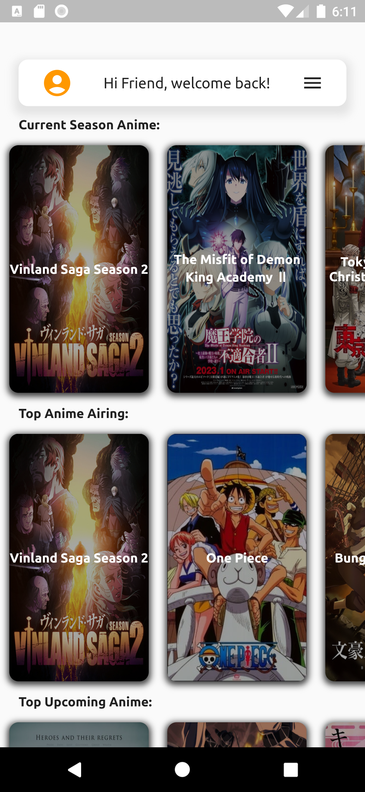
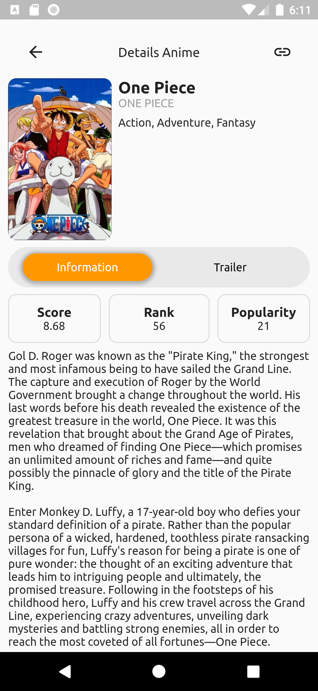
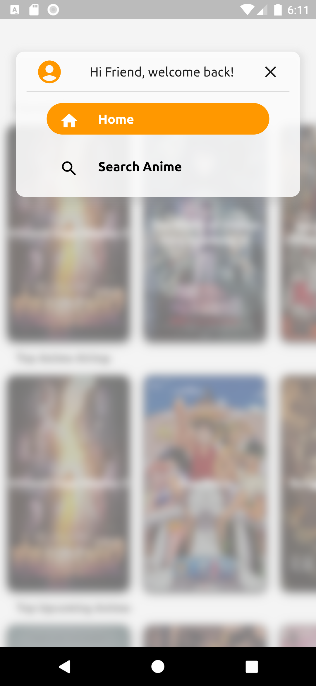
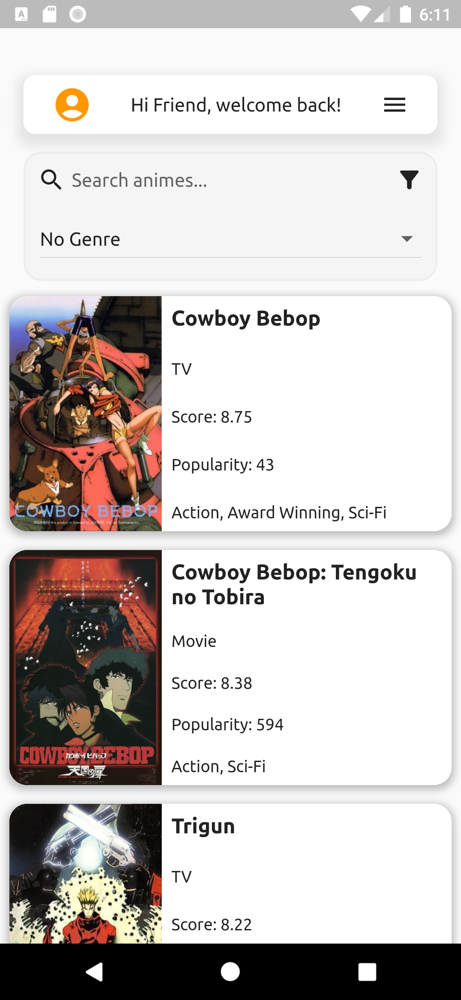

## Info Progetto
Nome: **Diego Polidori**

Matricola: **324712**

Titolo: **Animes**

## Spiegazione

L'applicazione sviluppata è una semplice app per mostrare informazioni riguardo gli anime. L'idea era quella di avere una piattaforma rapida ed intuitiva che permetteva di poter stare aggiornati sugli ultimi anime usciti e le varie classifiche senza dover visitare alcun sito web o ricerca; il tutto corredato da eventuali trailer per ogni anime, cosi da poter avere un'idea.

## Casi d'uso

Il pricipale uso dell'applicazione è quello di controllare gli ultimi anime pubblicati ed eventualmente gli anime stagionali. Per garantire ciò, all'avvio dell'applicazione l'utente approda nella HomePage dove vengono mostrati gli anime della stagione attuale, gli anime con il maggior successo attuale, gli anime che usciranno a breve ed infine gli anime più popolari di sempre. L'utente potrà avere maggiori informazioni su di uno di essi tramite il tap su una delle schede presenti e gli si aprirà una pagina di dettagli in cui potrà vedere il titolo in lingua originale, una sinossi dell'anime, diversi punteggi di classifica e, se disponibile, un trailer.

In caso non trovasse ciò che cerca, tramite il menù a tendina potrà spostarsi nella sezione di ricerca e tramite la personalizzazione di questa, trovare l'anime che più gli interessa.

## UI/UX

Per quanto riguarda la UI si è scelto un approccio "morbido" con ogni elemento che presenta bordi smussati cosi da dare un effetto rilassante alla vista dell'utente, si sono utilizzate le ombre per creare un effetto di profondità ed avere una maggior resa grafica. E' stata utilizzata una palette grafica composta di due colori: bianco e arancione, la quale si può notare in tutta l'applicazione. Per quanto riguarda il menu, una volta aperto crea un effetto di blur del background cosi da risultare maggiormente in primo piano. Per quanto possibile si sono inseriti effetti di animazione al menu e alla search.

Per quanto riguarda la UX si sono utilizzate liste a scorrimento sia orizzontale che verticale per garantire all'utente la visualizzazione di tutto il contenuto con il semplice scroll. E' stato garantito l'utilizzo agevole sia in verticale che in orizzontale, sia da tablet che da smartphone.

A seguire diversi screenshot dell'applicazione in esecuzione.

Home Page

---

Anime Details

---

Menu

---

Search

## Tecnologie

Tra lee tecnologie utilizzate troviamo:
- per le APIs sono state utilizzate una versione unofficial di MyAnimeList, [Jikan API](https://jikan.moe/). Si tratta di un portale dove è possibile trovare praticamente ogni informazione possibile su Anime e Manga. Per facilitare lo sviluppo è stato utilizzato un pacchetto di Flutter che gestiva le varie chiamate agli endpoint e lo sviluppo dei vari DTOs, [jikan_api](https://pub.dev/packages/jikan_api)
- la struttura del progetto ha cercato di rispettare per quanto possibile il paradigma di separazione della sorgente dati dalla componente view, in particolar modo in quest'ultima, si è realizzata un architettura a cascata dove il parent era sempre la pagina di destinazione e a scendere i vari componenti come body o topnav.
- per la persistenza dei dati si è utilizzato **HiveDB**, che garantisce il salvataggio delle informazioni in locale sul dispositivo garantendo un'elevata velocità di lettura e scrittura.
- per la gestione dello stato si è utilizzato il pacchetto **Provider** che ha facilitato di molto il mantenimento di informazioni tra le varie pages.
- per la navigazione tra pagine è stato adoperato sia il **Navigator** che una gestione personalizzata dei body all'interno della Home Page, andando a selezionare il corpo tra una serie di Widget.
- per la riproduzione dei trailer, visto che le api fornivano un link a YouTube, è stato integrato il pacchetto [youtube_player_flutter](https://pub.dev/packages/youtube_player_flutter)

Lo sviluppo è avvenuto interamente tramite emulatore Android, utilizzando si la versione minima SDK e la versione target SDK indicata nel progetto.

## Comportamenti anomali

Nonostante la gestione dei possibili errori tramite l'utilizzao di try catch, abbiamo notato la comparsa di eventuali messaggi di errore in console ma che non hanno mai comportato un blocco o un crash dell'applicativo.

## Possibili sviluppi futuri

Per poter ampliare l'applicazione sono state previste altri due bodies, uno per eventuali impostazioni ed uno per la gestione utente, come preferiti e gestione di più profili.